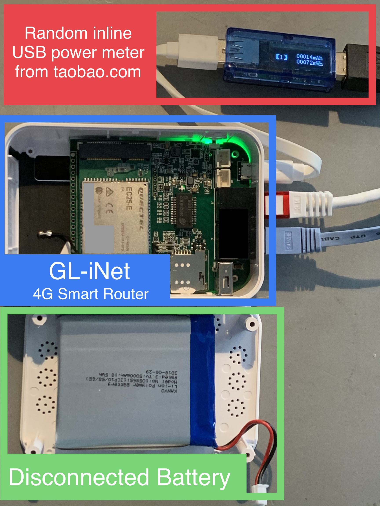

# Measurements
Some power measurements for [GL-iNet MiFi](https://www.gl-inet.com/products/gl-mifi/)
## Test Setup
<a href="url"></a>

## Scenarios

### Instantaneous Power Draw
|Activity|Uplink|Draw 4.89V|
|:------:|:------:|:--------:|
|File Transfer|Ethernet|350 mA|
|File Transfer|4G|650 mA|

### Idle
|Activity|Ethernet|WiFi|4G|lighthttpd|Consumption 4.89V|
|:------:|:------:|:--:|:-:|:-:|:--------:|
|idle    |Disabled|Disabled|Disabled|Disabled|140 mAh/30 min|
|idle    |Enabled|Disabled|Enabled|Disabled|166 mAh/30 min|
|idle    |Enabled|Enabled|Enabled|Enabled|182 mAh/30 min|

#### Disable Ethernet 
Unplug Ethernet 

#### Disable WiFi
Disable WiFi interface in ```/etc/config/wireless```:
```
config wifi-device 'radio0'
    option disabled '1'
```

#### Disable 4G
Disable the 4G modem through the console
```
AT+QPOWD=1
```


